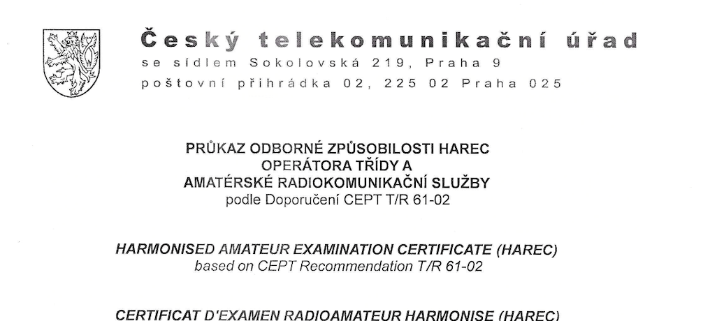
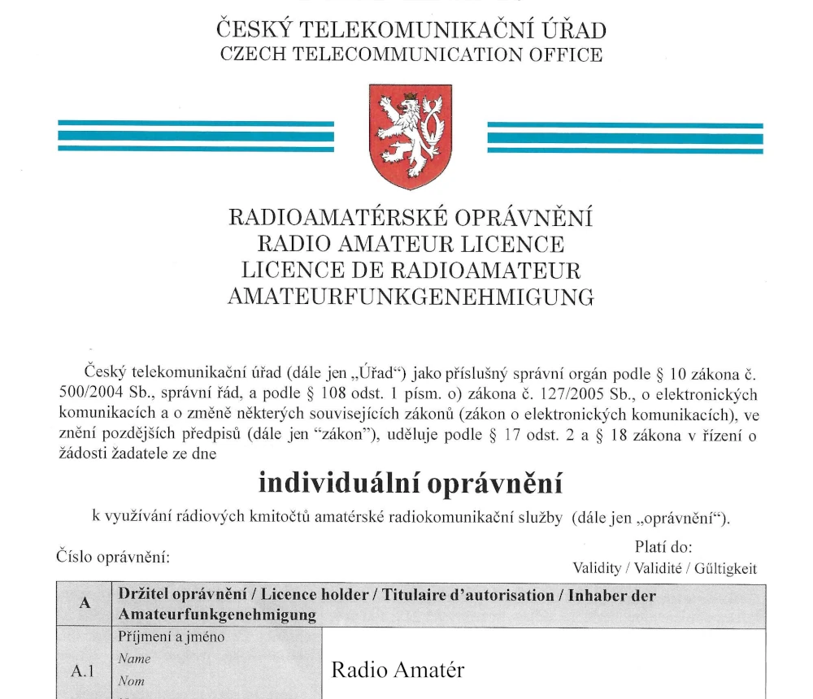

# Příprava ke zkouškám - základní informace

Gratulujeme k rozhodnutí udělat si zkoušky pro provoz na radioamatérských pásmech! Zde shrnujeme základní 
informace o přípravě k získání dvou potřebných dokumentů.

## Průkaz odborné způsobilosti
Celým názvem **Průkaz odborné způsobilosti pro obsluhu vysílacích rádiových zařízení amatérské radiokomunikační služby** vybrané třídy (o třídách viz dále). Tento dokument deklaruje, že uchazeč splnil všechny požadavky ke zkoušce pro získání průkazu odborné způsobilosti tak, jak je stanoveno v Doporučení CEPT T/R 61-02. Tento dokument je nutnou podmínkou pro získání vlastní radioamatérské volací značky. Tu však nezískám na základě tohoto dokumentu, ale až po zažádání o **Individuální oprávnění** (viz dále).

Průkaz odborné způsobilosti je někdy také nazývaný jako `vysvědčení` či `licence`.

::: info Náhled hlavičky průkazu odborné způsobilosti HAREC operátora třídy A

:::

## Individuální oprávnění
Celým názvem **Individuální oprávnění k využívání rádiových kmitočtů amatérské radiokomunikační služby**. 

Často nazývané jako `koncese` (jedná se o starší termín, který vžil a užívá se dodnes). Na základě tohoto dokumentu **získává radioamatér svou volací značku**. Vydává se na omezenou dobu (5 let) a pro zachování volací značky je potřeba požádat včas o obnovení platnosti individuálního oprávnění.

::: info Náhled individuálního oprávnění

:::

## Třídy průkazů odborné způsobilosti (licencí) v ČR
V České Republice si můžeš vybrat jednu ze dvou operátorských tříd:

### Třída N - NOVICE
Začátečnická třída ("novice" je anglické slovo pro začátečníka). 
Opravňuje držitele k obsluze stanice amatérské služby **s maximálním povoleným výkonem 10 W** v určených pásmech (frekvenčních rozsazích). 

### Třída A - HAREC
HAREC je zkratka pro "Harmonised Amateur Radio Examination Certificate".
Třída A opravňuje držitele k obsluze stanice amatérské služby **ve všech určených pásmech (frekvenčních rozsazích) s použitím maximálního povoleného výkonu**. 

Poznámka: Zkoušku na třídu A lze vykonat rovnou bez nutnosti vykonat nejdříve zkoušku na třídu N. Je to dokonce žádoucí, viz tip níže.  

::: tip TIP 💡
Zkušenost mnohých NOVICE operátorů ukazuje, že je lepší udělat si rovnou třídu A (HAREC), protože 
na třídu N se vztahují mnohá omezení, která tě dříve nebo později začnou limitovat. 

Pokud se i tak rozhodneš pro třídu N, měj na paměti, že pokud si budeš chtít "dodělat" třídu A, musíš 
se naučit všechny otázky znovu, nikoli jen rozdíl mezi třídami A a N. Proto je lepší udělat si rovnou třídu A.
:::

## Co ke zkoušce potřebuji znát?
Pro úspěšné složení zkoušky je potřeba naučit se správné odpovědi na testové otázky pro vybranou operátorskou třídu.

Všechny aktuálně platné testové otázky, které se potřebuješ naučit lze nalézt tady: 
- [Testové otázky pro získání třídy N (NOVICE)](https://hamotazky.cz/novice/prohlizeni)
- [Testové otázky pro získání třídy A (HAREC)](https://hamotazky.cz/harec/prohlizeni)

Jedná se však pouze o samotné testové otázky bez vysvětlení. S tím by však měl pomoci náš výukový portál, kde se snažíme vše vysvětlit. Sice se lze jen mechanicky naučit odpovědi ke zkoušce nazpaměť, ale mnohem **lépe si člověk vše zapamatuje když bude znát souvislosti a praktické přiklady**.

::: tip Poznámka ke zkoušce z telegrafie ℹ️
Dříve bylo nutné pro získání radioamatérské licence absolvovat i povinnou zkoušku z telegrafie (vysílání a příjem morseovy abecedy).
V ČR byla povinná zkouška z telegrafie zrušena v roce 2005.
:::

## Jak se všechny ty vědomosti mám naučit?
neboj nejsi jedinej, zvladlo to hodne lidi, je dobry mit skupinku kamosu, hamotazky, mobil appky, nas discord? kurzy, radiokluby, samostudium zde

