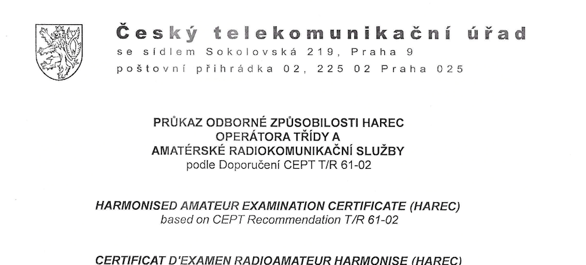
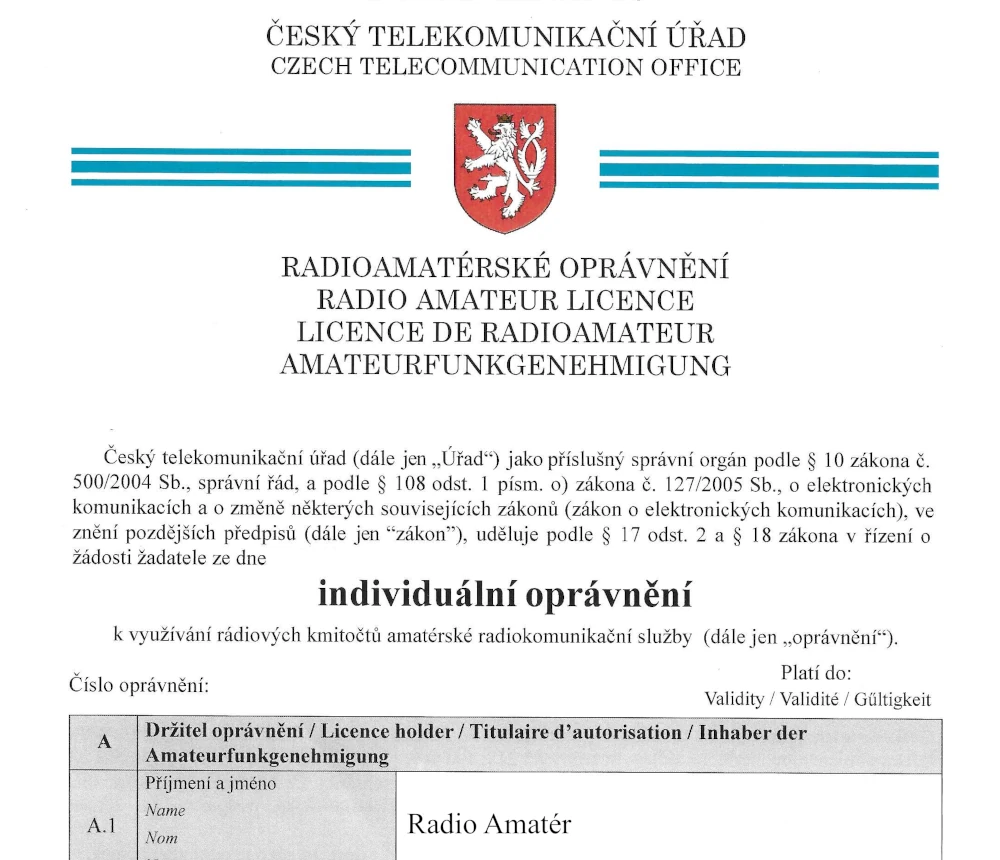

# Příprava ke zkouškám - základní informace

Gratulujeme k rozhodnutí udělat si zkoušky pro provoz na radioamatérských pásmech! Zde shrnujeme základní 
informace o přípravě k získání **dvou potřebných dokumentů**.

## Průkaz odborné způsobilosti
Celým názvem **Průkaz odborné způsobilosti pro obsluhu vysílacích rádiových zařízení amatérské radiokomunikační služby** vybrané třídy (o třídách viz dále). Průkaz odborné způsobilosti deklaruje, že uchazeč splnil všechny požadavky ke zkoušce pro získání průkazu odborné způsobilosti tak, jak je stanoveno v Doporučení CEPT T/R 61-02. Tento dokument je nutnou podmínkou pro získání vlastní radioamatérské volací značky. Tu však nezískám na základě tohoto dokumentu, ale až po zažádání o **Individuální oprávnění** (viz dále). Průkaz odborné způsobilosti má neomezenou časovou platnost a je akceptován i v dalších zemích, které jsou členy CEPT, nebo přistoupily k Doporučení CEPT T/R 61-01.

Průkaz odborné způsobilosti je někdy také nazývaný jako `licence`. V České Republice si můžeš vybrat jednu ze dvou operátorských tříd.

#### Třída N - NOVICE
Začátečnická třída ("novice" je anglické slovo pro začátečníka). 
Opravňuje držitele k obsluze stanice amatérské služby **s maximálním povoleným výkonem 10 W** v určených pásmech (frekvenčních rozsazích). 

#### Třída A - HAREC
HAREC je zkratka pro "Harmonised Amateur Radio Examination Certificate".
Třída A opravňuje držitele k obsluze stanice amatérské služby **ve všech určených pásmech (frekvenčních rozsazích) s použitím maximálního povoleného výkonu**. 

::: info Náhled hlavičky průkazu odborné způsobilosti HAREC operátora třídy A

:::

::: tip TIP 💡
Zkoušku na třídu A lze v ČR vykonat rovnou bez nutnosti vykonat nejdříve zkoušku na třídu N. Je to dokonce žádoucí - Zkušenost mnohých operátorů třídy N (NOVICE) ukazuje, že je výhodnější složit zkoušku rovnou na třídu A (HAREC). Pro
 třídu N totiž platí mnohá omezení, která tě dříve nebo později začnou limitovat. 

Pokud se i tak rozhodneš pro třídu N, měj na paměti, že pokud si budeš chtít "dodělat" třídu A, musíš 
se naučit všechny otázky znovu, nikoli jen rozdíl mezi třídami A a N. Proto je lepší udělat si rovnou třídu A.
:::

## Individuální oprávnění
Celým názvem **Individuální oprávnění k využívání rádiových kmitočtů amatérské radiokomunikační služby**. 

Často nazývané jako `koncese` (jedná se o starší termín, který vžil a užívá se dodnes). Na základě tohoto dokumentu **získává radioamatér svou volací značku**. Vydává se na omezenou dobu (5 let) a pro zachování volací značky je potřeba požádat včas o obnovení platnosti individuálního oprávnění.

::: info Náhled individuálního oprávnění

:::

## Co ke zkoušce potřebuji znát?
Pro úspěšné složení zkoušky je potřeba naučit se správné odpovědi na testové otázky pro vybranou operátorskou třídu.

Všechny aktuálně platné testové otázky, které se potřebuješ naučit lze nalézt tady: 
- [Testové otázky pro získání třídy N (NOVICE)](https://hamotazky.cz/novice/prohlizeni)
- [Testové otázky pro získání třídy A (HAREC)](https://hamotazky.cz/harec/prohlizeni)

Jedná se však pouze o samotné testové otázky bez vysvětlení. S tím by však měl pomoci náš výukový portál, kde se snažíme vše vysvětlit. Sice se lze jen mechanicky naučit odpovědi ke zkoušce nazpaměť, ale mnohem **lépe si člověk vše zapamatuje když bude znát souvislosti a praktické přiklady**.

::: tip Poznámka ke zkoušce z telegrafie ℹ️
Dříve bylo nutné pro získání radioamatérské licence absolvovat i povinnou zkoušku z telegrafie (vysílání a příjem morseovy abecedy).
V ČR byla povinná zkouška z telegrafie zrušena v roce 2005.
:::

## Jak se všechny ty vědomosti mám naučit?
Zpočátku na tebe bude nejspíš objem informací působit hrůzostrašně, ale věř, že **naprostá většina uchazečů o licenci zkoušku složila úspěšně**. Je několik způsobů, jak si cestu k nabytí potřebných vědomostí usnadnit. 

Můžeš si ve svém okolí najít zkušeného operátora, třeba z nejbližšího radioklubu, který bude ochoten ti pomoci s vysvětlením toho, čemu nerozumíš. **Za nás doporučujeme zúčastnit se jednoho ze dvou kurzů**. Jeden pořádá [Český radioklub ](https://ceskyradioklub.cz/), výuka se odehrává v budově ČRK v Praze. [Druhý kurz](https://www.ok1zhv.eu/) probíhá v penzionu v malebném prostředí Orlických hor. Na obou se ti budou věnovat zkušení lektoři, kteří odpoví na každou tvou otázku. A jako bonus se seznámíš s dalšími budoucími radioamatéry, se kterými se můžete před zkouškami vzájemně podporovat a motivovat. 

Další možností je samozřejmě i samostudium pomocí materiálů na tomto portálu.

A rozhodně ti doporučujeme po celou dobu studia opakovaně procvičovat testové otázky a absolvovat cvičné testy na webu [hamotazky.cz](https://hamotazky.cz/). Ten obsahuje všechny aktuální otázky, na které pak při skládání zkoušky můžeš narazit. Případně pokud jsi náhodou uživatelem iPhone nebo iPadu, existuje pro trénink otázek a testů aplikace [Ham operátor](https://itunes.apple.com/app/apple-store/id6472734388?mt=8).

