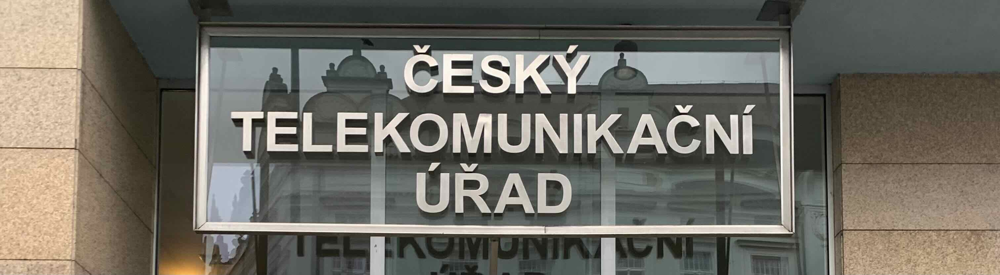

# Jak se ke zkoušce přihlásím?

Až si budeš myslet, že jsi připraven na složení zkoušky, **je na čase podat si přihlášku**. V ČR zkoušky vyhlašuje a organizuje **Český telekomunikační úřad (ČTÚ)**. Na [ePortálu ČTÚ](https://eportal.ctu.gov.cz/) jsou k dispozici on-line formuláře, které vyplníš, pošleš a zaplatíš příslušné poplatky.

ePortál ČTÚ umožňuje pohodlné vyplnění formulářů na počítači, mobilním telefonu, či tabletu přímo na webu ePortálu, bez potřeby instalovat jakýkoli dodatečný software nebo aplikace. Po vyplnění formulářů je **pro přihlášené uživatele** (přihlásit se můžu do ePortálu například bankovní identitou, nebo pomocí datové schránky), možné rovnou zaplatit 
správní poplatky on-line pomocí platební brány.

::: tip Kdy se koná další zkouška?
Termín nadcházejících zkoušek HAREC/NOVICE lze nalézt na stránce [Oznámení termínu zkoušek](https://ctu.gov.cz/oznameni-terminu-zkousek).
::: 

## Jaké formuláře musím vyplnit?
Jak jsme nastínili v kapitole [Příprava ke zkouškám](/priprava-ke-zkouskam/), k tomu abych se stál radioamatérem s vlastní volací značkou potřebuji:

- Průkaz odborné způsobilosti k obsluze vysílacích rádiových zařízení (někdy nazýváno jako `licence`)
- Individuální oprávnění k využívání rádiových kmitočtů amatérské radiokomunikační služby (někdy nazýváno jako `koncese`)

Pro získání každé z výše zmíněných listin je potřeba vyplnit příslušný formulář, **celkem tedy budeš vyplňovat dva formuláře**. V článku [Jak vyplnit formuláře](/priprava-ke-zkouskam/jak-vyplnit-formulare) se dozvíš jak na to.
