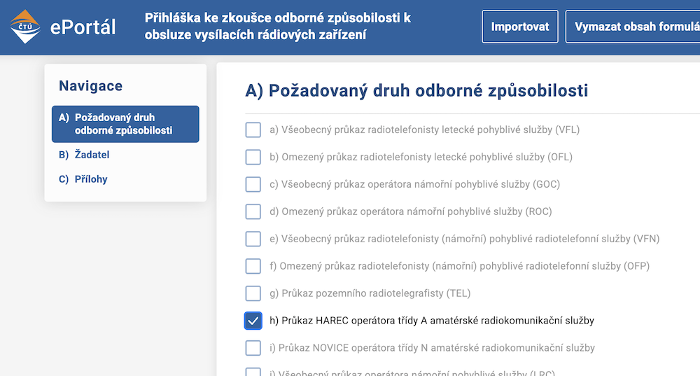

# Jaký je postup pro vyplnění formulářů?

::: info Náhled přihlašovacího formuláře na ePortálu ČTÚ

:::

## Formálně správný způsob
1. Vyplnit formulář [Přihláška ke zkoušce odborné způsobilosti k obsluze vysílacích rádiových zařízení](https://eportal.ctu.gov.cz/form/10) a zaplatit správní poplatek

2. Až ČTÚ vyhlásí termín zkoušky, dorazit na místo, vykonat úspešně zkoušku a vyčkat, než ti do schránky dorazí průkaz odborné způsobilosti (úřad má na vydání 30 dní)

3. Vyplnit formulář 13N [Žádost k individuálnímu oprávnění k využívání rádiových kmitočtů amatérské radiokomunikační služby (klubové stanice a stanice jednotlivců)](https://eportal.ctu.gov.cz/form/13N) a zaplatit správní poplatek

4. Počkat, než ti do schránky dorazí individuální oprávnění (úřad má na vydání 30 dní)

Z (formálně správného) postupu uvedeného výše je vidět, že žádosti na sebe navazují a měly by se podat jedna po druhé - musím tedy čekat vlastně dvakrát - pro kažou žádost zvlášť. Ve skutečnosti, ale ČTÚ akceptuje i zjednodušený a rychlejší způsob, kde bude čekací lhůta jen jedna.

## Zjednodušený způsob
1. Vyplnit formulář [Přihláška ke zkoušce odborné způsobilosti k obsluze vysílacích rádiových zařízení](https://eportal.ctu.gov.cz/form/10) a zaplatit správní poplatek **a zárověň s ním** vyplnit i druhý formulář 13N [Žádost k individuálnímu oprávnění k využívání rádiových kmitočtů amatérské radiokomunikační služby (klubové stanice a stanice jednotlivců)](https://eportal.ctu.gov.cz/form/13N) a zaplatit správní poplatek

2. Až ČTÚ vyhlásí termín zkoušky, dorazit na místo, vykonat úspešně zkoušku a vyčkat, než ti do schránky dorazí průkaz odborné způsobilosti **zárověň s ním** i individuální oprávnění (úřad má na vydání 30 dní)
