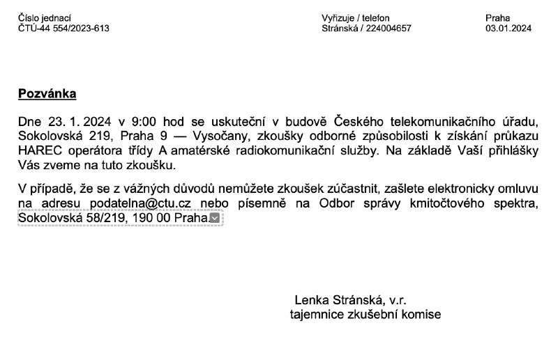

# Kdy se koná další zkouška?

V ČR zkoušky vyhlašuje a organizuje **Český telekomunikační úřad (ČTÚ)**. Termíny nadcházejících zkoušek HAREC/NOVICE lze  nalézt na webu ČTÚ na stránce [Oznámení termínu zkoušek](https://ctu.gov.cz/oznameni-terminu-zkousek).
Termíny jsou vyhlašovány zpravidla v Praze v závislosti na naplnění kapacity přihlášených uchazečů.

::: info Pozvánka na zkoušku HAREC

:::
