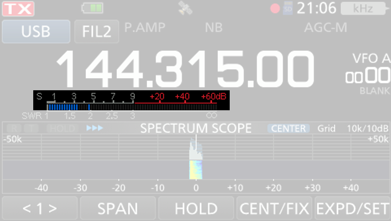

# Systém RST

**Kvalita rádiového spojení závisí na mnoha faktorech**: použitém vysílacím výkonu, anténě, vzdálenosti mezi stanicemi a také na aktuálních podmínkách [šíření rádiových vln](/priprava-ke-zkouskam/radiovy-provoz/sireni-vln). Proto **je vždy zajímavé vědět, jak dobře mě protistanice slyší**. Pro posouzení kvality příjmu se po navázání spojení udává tzv. **report**. V radioamatérské praxi se k tomuto účelu používá **systém RST**.

## Struktura reportu
Předávaný report (RST) sestává z následujících tří hodnot:

### R (z anglického readability - čitelnost)
Toto číslo **označuje čitelnost signálu** a pohybuje se v rozmezí od 1 do 5. Čitelnost znamená srozumitelnost. Vyšší číslo znamená lepší srozumitelnost. Čitelnost se hodnotí **subjektivně** na základě faktorů, jako jsou hlasitost, čistota, rušení a zkreslení.

| R | Hodnocení                   |
| - | --------------------------- |
| 1 | nečitelné                   |
| 2 | občas čitelné               |
| 3 | čitelné s obtížemi          |
| 4 | čitelné bez obtíží          |
| 5 | perfektně srozumitelné      |

### S (z anglického strength - síla signálu)
Toto číslo **označuje sílu signálu** a pohybuje se v rozmezí od 1 do 9. Vyšší číslo znamená silnější signál. Síla signálu se obvykle odečítá z měřiče síly signálu (který se nazývá **S-metr**) na transceiveru. Mnoho S-metrů může zobrazovat i hodnoty nad 9. Tyto hodnoty se pak zpravidla zobrazují jinak - v decibelech (dB) nad úrovní 9. Hodnota S v předávaném reportu se pak uvádí například jako: 9 +20 dB. 

### T (z anglického tone - tón)
Toto číslo se používá pouze při telegrafických spojeních (při použití morseovy abecedy) a označuje kvalitu tónu. Při hlasové (FONE) komunikaci se vynechává.

TODO audio priklady - peknej ton a bidnej ton

## Příklady předávaného reportu ve FONE (hlasovém) provozu

| Srozumitelnost     | Hodnota na S-metru | Předaný report (RST) |
| ------------------ | ------------------ | -------------------- |
| perfektní          | +20 dB             | 59 +20dB             |
| perfektní          | 9                  | 59                   |
| bez obtíží         | 5                  | 45                   |
| s obtížemi         | 3                  | 33                   |
| nesrozumitelné     | 1                  | 13                   |

TODO audio ukazky?

## Příklady S-metrů

TODO priklad HT S-metru

Na následujícím obrázku je displej transceiveru ICOM IC-9700 se zvýrazněným S-metrem:

S-metr může být i analogový (ručičkový) a může vypadat podobně jako na následující ilustraci:

## Historie a napěťové úrovně
V dřívějších dobách se síla přijímaného signálu určovala subjektivně na škále od 1 do 5. Postupem času došlo k tomu, že se přešlo na stupnici 1 - 9 a místo subjektivního hodnocení se síla signálu určovala měřicím přístrojem, S-metrem.

V roce 1981 vydala Mezinárodní Radioamatérská Unie (IARU) pravidla, podle kterých se určuje síla signálu přesněji, podle napětí na vstupu přijímače. **Hodnoty se liší na krátkých vlnách** (KV - tj. pod 30 MHz) **a velmi krátkých vlnách** (VKV - nad 30 MHz). Jednotlivé stupně „S“ jsou odstupňovány po 6 dB. 

| Stupeň „S“ | KV               | VKV              |
| ---------- | ---------------- | ---------------- |
| 9+60dB     | 50mV (-13dBm)    | 5mV (-33dBm)     |
| 9+40dB     | 5mV (-33dBm)     | 500µV (-53dBm)   |
| 9+20dB     | 500µV (-53dBm)   | 50µV (-73dBm)    |
| 9+10dB     | 160µV (-63dBm)   | 16µV (-83dBm)    |
| 9          | 50µV (-73dBm)    | 5µV (-93dBm)     |
| 8          | 25µV (-79dBm)    | 2.5µV (-99dBm)   |
| 7          | 12.5µV (-85dBm)  | 1.25µV (-105dBm) |
| 6          | 6.25µV (-91dBm)  | 0.63µV (-111dBm) |
| 5          | 3.12µV (-97dBm)  | 0.31µV (-117dBm) |
| 4          | 1.56µV (-103dBm) | 0.16µV (-123dBm) |
| 3          | 0.78µV (-109dBm) | 0.08µV (-129dBm) |
| 2          | 0.39µV (-115dBm) | 0.04µV (-135dBm) |
| 1          | 0.2µV (-121dBm)  | 0.02µV (-141dBm) |

V pásmu krátkých vln, tj. pod 30 MHz, odpovídá S9 vstupnímu výkonu na vstupních svorkách přijímače –73 dBm tj. 50µV na vstupním odporu 50 ohm. 

V pásmu velmi krátkých vln, tedy v pásmech nad 30 MHz se hodnota snižuje o 20 dBm na úroveň –93 dBm, tj. 5 µV na vstupním odporu 50 ohm.

