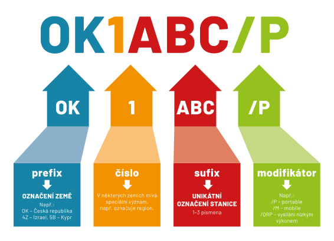

# Volací znak

**Volací znak**, také **volací značka**, či anglicky **callsign**, je jedinečná a celosvětově platná identifikace konkrétního radioamatéra.

Při rádiovém provozu je třeba volací značku uvádět **na začátku a na konci každé relace**, a během relací které trvají déle je třeba svůj volací znak uvádět minimálně každých 10 minut.

## Anatomie volacího znaku
Volací znak sestává ze sekvence písmen a číslic podle přesně daného schématu.

### Speciální případy
TODO /p /m /mm /am /4, CEPT vysilani z jine zeme

## Volací znaky v ČR

| Prefix               |  Význam                                   | Příklad          |
|----------------------|-------------------------------------------|------------------|
| OK0 a 1-3 znaky      | Neobsluhované stanice (převaděče, majáky) | OK0C, OK0BBF     |
| OK1-OK7 a 2-3 znaky  | Operátoři s licencí třídy A (HAREC)       | OK2MAX, OK7SKF   |
| OK8 a 2-3 znaky      | Licence vydané cizím státním příslušníkům na základě licence třídy A (HAREC) nebo jejího ekvivalentu uznaného CEPT, vydaného v zahraničí | OK8AB, OK8HEL |
| OK9 a 3 znaky        | Operátoři s licencí třídy N (NOVICE)      | OK9NKS, OK9DDD   |
| OK1K-OK2K a 2 znaky  | Licence vydaná pro klubovou stanici       | OK1KKL, OK2KOJ   |
| OK1O-OK2O a 2 znaky  | Licence vydaná pro klubovou stanici       | OK1OMG, OK2OBR   |
| OK1R-OK2R a 2 znaky  | Licence vydaná pro klubovou stanici       | OK1RLC, OK2RJC   |
| OK1-OK7 a 1 znak     | Volací znaky pro použití v radioamatérských závodech | OK2M, OK5L |
| OL1-OL9 a 1 znak     | Volací znaky pro použití v radioamatérských závodech | OL5W, OL9X |
| OL1-OL9 a 2-n znaků  | Volací znaky pro speciální události       | OL1KOTA, OL25PRADED |

## Jakou si mám vybrat volací značku/volací znak?
V žádosti o individální oprávnění mám možnost si navrhnout svou volací značku. **Pokud je značka volná, úřad zpravidla
návrhu vyhoví a značku přidělí**.

TODO prakticke rady ke tvorbe - delka, telegraf?

::: info Jak zjistím, jestli je značka volná?
Jestli je mnou požadovaný volací znak volný zjistím na [Informačním portálu o udělených individuálních oprávněních](https://ctu.gov.cz/vyhledavaci-databaze/databaze-pridelenych-radiovych-kmitoctu-podle-vydanych-pridelu-a-individualnich-opravneni/amateri). Stačí vyplnit můj návrh na značku do pole `Volací značka` (ostatní pole nechat volná) a potvrdit. 

Pokud systém najde nějaký záznam, znamená to, že značku používá jiný držitel. Pokud systém žádný záznam nenajde, je značka nejpíše k dispozici. Schválně píšeme nejspíše: pokud vybraná značka vypršela teprve nedávno a původní držitel značku zatím neprodloužil, ČTÚ drží "ochrannou lhůtu" pro původního držitele. Jak je lhůta dlouhá není známo, ale slouží k ochraně původního majitele pro případ, že by ze závažných důvodů nemohl svou značku prodloužit ve stanoveném termínu těsně před vypršením.
:::

## Prefixy volacích značek ve zkoušce
Prefixy volacích znaků jsou jedno z nejobávanějších zkouškových témat, protože neexistuje žádný klíč, podle kterého by se daly snadno zapamatovat. 

TODO poslech na pasmu, mapa, audio, mnemotechnike pomucky, utility programy, co o zemi vim

### Více o volacích značkách
Pokud tě zajímají mnohem detailnější informace, vynikající popis je v článku [Amateur radio call signs](https://en.wikipedia.org/wiki/Amateur_radio_call_signs) na anglické Wikipedii. 

## Otázky ke zkoušce 🎓

#### Třída A (HAREC)
- [Testové otázky HAREC z kategorie Používání prefixů ve volacích značkách](https://hamotazky.cz/harec/prohlizeni/prefixy)

#### Třída N (NOVICE)
- [Testové otázky NOVICE z kategorie Používání prefixů ve volacích značkách](https://hamotazky.cz/novice/prohlizeni/prefixy)