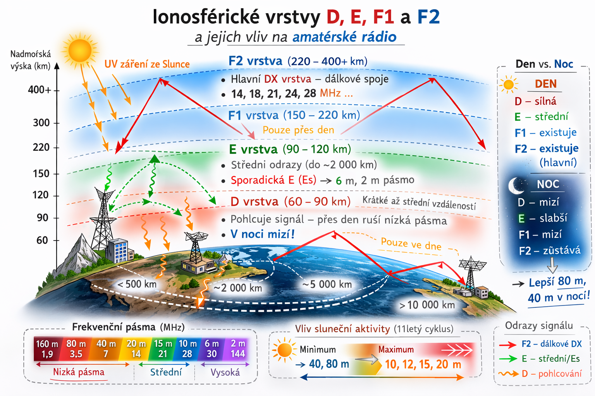

# Atmosféra a její vliv na šíření rádiových vln

Různé oblasti zemské atmosféry mají různý vliv na šíření rádiových vln a do značné mohou ovlivňovat rádiovou komunikaci.
Efekty jako je odraz, lom, difrakce atd. se všechny podílí na šíření signálu atmosférou. Bez jejího působení by nebylo možné, aby se signály šířily po celé zeměkouli v pásmu krátkých vln nebo aby se signály o vyšších frekvencích šířily na větší vzdálenosti, než je pouze přímá viditelnost.

## Atmosférické vrstvy
Vzhledem k důležitosti atmosféry pro rádiovou komunikaci se na ní a na některé její oblasti podíváme detailněji.
Atmosféra může být rozdělena do mnoha různých vrstev podle jejich vlastností.

Nejnižší oblast v meteorologickém systému je označována jako troposféra. Ta sahá do výšek kolem 10 km nad povrchem Země. Nad tím je stratosféra, která se rozprostírá v nadmořských výškách kolem 10 až 50 km. Nad tím ve výškách mezi 50 a 80 km se nachází mezosféra a nad ní termosféra.

Z hlediska šíření rádiových vln tu existují dvě hlavní oblasti zájmu:
- Troposféra 
- Ionosféra

## Troposféra
Nejnižší z vrstev atmosféry se nazývá troposféra. Troposféra sahá od povrchu země do nadmořské výšky 10 km. To, co nazýváme počasím, se odehrává v troposférické oblasti. 

Za normálních okolností v této oblasti atmosféry dochází k poklesu teploty s přibývající výškou. **Troposférické šíření** vzniká, když se tento jev "otočí", tedy **při teplotní inverzi**, kdy nad studeným vzduchem je vrstva teplejšího vzduchu. Troposférické šíření se uplatňuje v pásmech VKV (velmi krátkých vln) a vyšších, tedy **pásma 2 m, 70 cm, 23 cm ale i pásma mikrovlnná**. Existují 2 druhy tropo šíření.

### Troposférická refrakce (ohyb)
Signál se mírně ohne změt k Zemi a místo 150 km je možné dělat spojení na 300–500 km. Signál je zpravidla stabilní a bez kolísání (uníků/fadingu).

### Troposférický kanál (ducting)
Při teplotní inverzi vznikne „kanál“ mezi vrstvami vzduchu. Signál se v něm šíří na stovky km a někdy až přes 1000 km. Tento kanál vzniká často podél pobřeží nebo nad mořem.

## Ionosféra
Ionosféra je oblast, která je tradičně spojována se schopností navazovat rádiová spojení na veliké vzdálenosti v pásmu krátkých vln. **V ionosféře se vyslané signály za určitých podmínek dokážou odrazit zpět k Zemi** a to i několikrát tam a zpět.

Ionosféra má vysokou hladinu volných elektronů a iontů – odtud název ionosféra. Zjistilo se, že hladina elektronů prudce narůstá ve výškách kolem 30 km, ale až ve výškách kolem 60 km jsou volné elektrony dostatečně husté, aby výrazně ovlivnily rádiové signály.

K ionizaci dochází v důsledku záření, **zejména ze slunce**, dopadajících na molekuly vzduchu s dostatečnou energií k uvolnění elektronů a zanechání kladných iontů.

Hladina volných elektronů se v ionosféře mění a **existují oblasti, které ovlivňují rádiové signály více, než jiné**. Ty se často označují jako vrstvy a mají označení **D, E a F1 a F2**.

### Popis ionosférických oblastí/vrstev

::: info Obrázek 1: Grafické znázornění ionosferických oblastí

:::

#### Oblast D
Se nachází ve výšce zhruba 60–90 km nad povrchem Země. **Vzniká jen ve dne působením slunečního záření, po západu slunce rychle mizí**. Na kmitočtech krátkých vln cca pod 10 MHz (tedy pásma 160m, 80m, 40m) je signál značně pohlcován a je tedy ve vrstvě D přes den značně utlumen, dalo by se tedy říct, že tato vrstva spíše škodí, než pomáhá. 
**Když po setmění vrstva D zmízí**, zmíněné kmitočty již nejsou touto vrstvou tlumeny a 
**signály se tak mohou odrážet od vyšších vrstev ionosféry**, tedy vrstev E a sloučených vrstev F1+F2, což má za následek **šíření na mnohem delší vzdálenosti**, než ve dne. Proto tyto nižsí pásma „ožívají“ až po setmění, když vrstva D zmizí.

#### Oblast E
Se nachází ve výšce zhruba 90–150 km nad povrchem Země. **Vzniká krátce po východu slunce působením slunečního záření, její maximum je kolem poledne, po západu slunce během několika hodin zaniká**. Umí odrážet nižší KV (krátkovlnná) pásma (např. 40m, 30m, 20m). Nejdůležitější věc u vrstvy E je však jev zvaný **Sporadická vrstva E (Es)**, což je náhodné, velmi silné zhuštění ionizace v E vrstvě kdy vznikají „mraky“ silně ionizovaného vzduchu, které **dokážou odrážet i velmi vysoké frekvence** (pásma 6m, 4m a vzácně i 2m). Sporadická vrstva E zpravidla vydrží někdy jen pár minut, někdy však i několik hodin a objevuje se zpravidla v letní sezóně, typicky přes den a večer, méně často se může objevovat i v zimě.

#### Oblast F (F1 a F2)
Oblast F se **ve dne** dělí na dvě podoblasti F1 (výška cca 150–220 km) a F2 (výška cca 220–400+ km), které se v noci spojují do jedné vrstvy F.  **Jedná se nejdůležitější vrstvu pro navazování spojení na velmi dlouhé vzdálenosti (tzv. DX spojení)**. 

**Vrstva F1** existuje jen přes den, pomáhá s šířením na středních KV (krátkovlnných) pásmech, ale není klíčová pro mezikontinentální spojení.

**Vrstva F2** existuje přes den i v noci a **je to nejdůležitější vrstva pro navazování mezikontinentálních DX spojení**, protože to je to **nejvýše položená vrstva** → signál se tak odrazí dál.

**Čím více je slunečních skvrn, tím vyšší frekvence se od oblasti F odráží** a proto v období maxima slunečního cyklu (tyto cykly mají periodu přibližně **11 let**) jsou "otevřená" i vyšší pásma (např. 10 m).