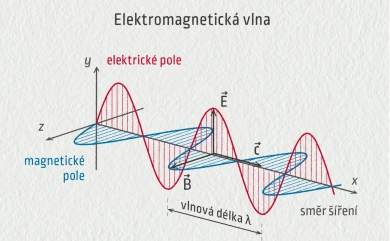

# O rádiových vlnách

V této kapitole se seznámíme s pojmy a jevy, které se týkají šíření rádiových vln a umožňují dálkovou komunikaci.  Způsoby, jakými se elektromagnetické vlny šíří od vysílacího zdroje k přijímací anténě, hrají klíčovou roli při navazování spojení. 

## Co je to elektromagnetická (rádiová) vlna?
Podobně jako světlo jsou i rádiové vlny druhem elektromagnetického záření. Jedná se o elektromagnetické vlnění, které se šíří prostorem od vysílací antény k přijímací.

Elektromagnetické záření se skládá ze **dvou složek, elektrické a magnetické** (které jsou neoddělitelné) a jejichž roviny jsou navzájem kolmé. Elektromagnetické vlny si můžeme představit jako synchronizované oscilace elektrického a magnetického pole.

::: info Obrázek 1: Grafické znázornění elektromagnetické vlny

:::

**Elektromagnetické vlny jsou klíčem k rádiové komunikaci**. Skutečnost, že se mohou šířit na obrovské vzdálenosti a také se **odrážet, lámat a ohýbat**, znamená, že se po mnoho let používají pro komunikaci na všechny vzdálenosti – od několika centimetrů až po tisíce kilometrů.

## Rychlost šíření

Všechny druhy elektromagnetického záření se šíří stejnou rychlostí, v podstatě **rychlostí světla**, což je **zaokrouhleně cca 300 000 km/s**. Rychlost světla ve vakuu, značena symbolem `c`, je přesně 299 792 458 metrů za sekundu.

## Frekvence
Frekvence elektromagnetického vlnění je tím, co určuje jeho polohu v rámci rádiového spektra. 
**Je to je počet, kolikrát se určitý bod na vlně pohybuje nahoru a dolů za daný čas (obvykle za sekundu)**. Jednotkou frekvence je Hertz, je značena symbolem `Hz` a rovná se jednomu cyklu za sekundu. Jednotka je pojmenována po německém vědci [Heinrichu Hertzovi](https://cs.wikipedia.org/wiki/Heinrich_Hertz), který objevil rádiové vlny. 

Frekvence signálu je vidět například na stupnicích rádiových přijímačů nebo radioamatérských transceiverů.

TODO obrazky z prijmacu/TRX

U frekvencí používaných v rádiové komunikaci se často používají [předpony soustavy SI](https://cs.wikipedia.org/wiki/P%C5%99edpona_soustavy_SI), protože tyto frekvence jsou obvykle velmi vysoké. 

Tabulku s nejpoužívanějšími předponami *SI* používaných v rádiové komunikaci uvádíme níže.

| 10n | Předpona | Značka | Název | Násobek       | Příklad           |
|----------------|----------|--------|-------|---------------|-------------------|
| 103 |  kilo    |    k   |  kilo | 1 000         | kHz – kilohertz   |
| 106 |  mega    |    M   |  mega | 1 000 000     | MHz – megahertz   |
| 109 |  giga    |    G   |  giga | 1 000 000 000 | GHz – gigahertz   |

## Vlnová délka
**Vlnová délka je vzdálenost mezi daným bodem v jednom cyklu a stejným bodem v dalším cyklu**, jak je znázorněno na obrázku 1.

Je důležitou vlastností jakéhokoli rádiového signálu a určuje mnoho aspektů při návrhu radioelektronických obvodů,návrhu **antén** až po povolené vzdálenosti na deskách plošných spojů.

Pro přepočet frekvence na vlnovou délku slouží následující vzorec: 

`λ = c / f`

Kde:
- λ = vlnová délka v metrech
- c = rychlost rádiových vln (pro praktické účely brána jako 300 000 000 metrů za sekundu)
- f = frekvence v Hertzech

#### Příklady vlnových délek některých radioamatérských pásem

| Pásmo | Vlnová délka |
|--------|-------------|
|3,5 MHz |   80m       |
|  7 MHz |   40m       |
| 14 MHz |   20m       |
| 28 MHz |   10m       |
| 144 MHz|   2m        |
| 430 MHz|   70cm      |
| 1,3 GHz|   23cm      |

## Polarizace
Anténa vysílá **polarizované záření** - polarizaci rádiových vln určuje směr elektrické složky pole (na obrázku 1 značeno jako `E`).

TODO vice detailu a popis proc je to dulezity a jakou to hraje roli

TODO sekce s odkazama na otazky