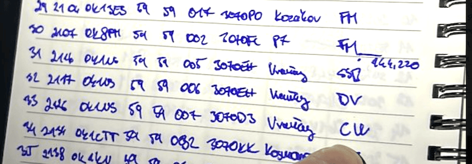

# Staniční deník (logger/log)

Myšlenka staničního deníku (anglicky logu) je velmi jednoduchá. **Jde o místo, kam si zapisovat své uskutečněná spojení**.
V dobách dávno minulých, před masovým rozšířením počítačů se spojení zapisovala do papírového deníku. Tyto doby jsou pryč a dnes naprostá většina radioamatérů vede své deníky v počítači, případně používají webové deníky.

::: info Závodní log v papírové podobě

:::

::: tip Poznámka
Ačkoli zákon nevyžaduje vedení staničního deníku (vyjma klubových stanic), téměř všichni si staniční deník vedou.
:::

TODO FOTKYYY

## Proč si vést staniční deník?
TODO
vidim s kym a kdy , kde a jakym druhem provozu jsem delal spojeni, muzu si zapisovat poznamky ke spojeni, vim jaky zeme jsem udelal (statistiky). venkovni aktivity- lovci ocekavaji ze uploadnes svje qso kvuli awardum atd
potvrzovani spojeni pomoci externich sluzeb (o nich dale), muzu posilat QSL listky a vim co na ne napsat (o qsl dale)

## Co se do deníku zapisuje?
datum, utc cas, protistanice, pasmo-frekvence, druh provozu, report. contestove deniky a jejich specialni policka (exchange)

